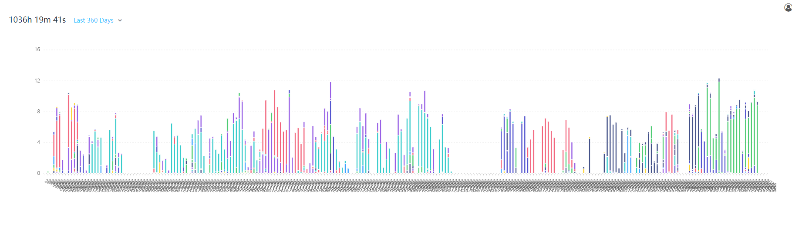

# Wakatime Dashboard
>Wakatime Dashboard gets data from Gist. 

Wakatime Dashboard 用于显示从 WakaTime 备份到 Gist 的统计数据。




如果觉得对你有帮助，请点波 star 支持下作者，非常感谢~

## 备份 WakaTime 数据到 Gist
关于如何备份 WakaTime 数据到 Gist 的具体请可以看：[wakatime-sync](https://github.com/superman66/wakatime-sync)。

## Usage

```
git clone git@github.com:TestSmirk/wakatime-dashboard.git && cd wakatime-dashboard
npm run dev
```

## build

```
npm run build
```
